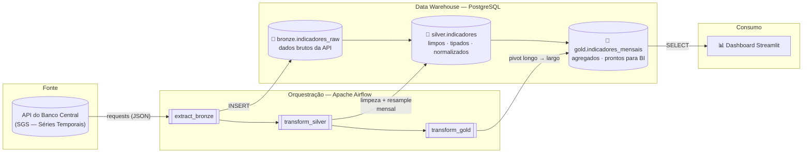

# 🏗️ Pipeline ETL Orquestrado — Indicadores Econômicos do Brasil

Pipeline de dados completo e orquestrado: extrai indicadores econômicos reais de uma
API pública, organiza-os em um data warehouse PostgreSQL com arquitetura em camadas
(Bronze → Silver → Gold), orquestra tudo com **Apache Airflow** e expõe o resultado
em um dashboard interativo — tudo containerizado com **Docker**.

🔗 **Repositório:** _adicionar após publicação_
🔗 **Dashboard ao vivo:** _adicionar após publicação (opcional)_

## Por que este projeto

Pipelines ETL orquestrados são o tipo de projeto mais pedido em vagas de **Engenharia
de Dados** — eles demonstram, em um único lugar, integração com APIs externas,
modelagem de dados em camadas, orquestração com agendamento/retries, containerização
e entrega de valor final (visualização). Este projeto cobre o ciclo completo de ponta
a ponta, com dados reais e atualizados diariamente.

## Arquitetura



Tudo roda em containers Docker: dois bancos PostgreSQL (metadados do Airflow e o
data warehouse), o Airflow (webserver + scheduler) e o dashboard.

## Os dados

Quatro indicadores econômicos extraídos diretamente da **API de Séries Temporais (SGS)
do Banco Central do Brasil** — sem necessidade de chave/login:

| Indicador | Série SGB | Granularidade original | Tratamento na Silver |
|---|---|---|---|
| Câmbio USD/BRL (compra) | 1 | diária | agregado para média mensal |
| Taxa Selic | 11 | diária | agregado para média mensal |
| IPCA — variação mensal | 433 | mensal | normalizado |
| Taxa de desemprego (PNAD Contínua) | 24369 | mensal | normalizado |

A mistura de granularidades (diária + mensal) é proposital: ela exige uma etapa de
**transformação real** (resample/agregação) para unificar tudo em uma única tabela
analítica mensal — exatamente o tipo de problema que aparece em pipelines de produção.

## Modelo de dados — arquitetura em camadas (medallion)

- **🥉 Bronze** (`bronze.indicadores_raw`) — dados crus, exatamente como retornados
  pela API, com timestamp de extração. Camada de auditoria/replay.
- **🥈 Silver** (`silver.indicadores`) — dados limpos, tipados (`NUMERIC`), com nomes
  e unidades padronizados, e já normalizados para granularidade mensal (formato longo:
  uma linha por indicador/mês).
- **🥇 Gold** (`gold.indicadores_mensais`) — formato largo (uma linha por mês, uma
  coluna por indicador), pronta para consumo direto por dashboards e ferramentas de BI.

## Orquestração — Airflow

A DAG `etl_indicadores_economicos` (`dags/etl_indicadores_dag.py`) executa diariamente
às 09h e encadeia três tarefas com dependências explícitas, retries automáticos
(2 tentativas, 5 min de intervalo) e logs centralizados:

```
extract_bronze  →  transform_silver  →  transform_gold
```

A lógica de negócio fica isolada em `src/` (testável e executável fora do Airflow via
`python -m src.pipeline`); a DAG é responsável apenas por orquestração — uma separação
que facilita testes unitários e reuso.

## Como rodar

### Opção 1 — Stack completa com Docker (Airflow + Postgres + dashboard)

```bash
git clone <url-do-repositorio>
cd pipeline-etl-indicadores

docker compose up -d
```

- Airflow UI: http://localhost:8080 (usuário `admin`, senha `admin`)
- Ative a DAG `etl_indicadores_economicos` e dispare uma execução manual
- Data warehouse (Postgres): `localhost:5434` (banco `indicadores`, usuário `etl_user`)

> **Nota de recursos:** a stack completa (2x Postgres + Airflow) consome ~3-4 GB de RAM.
> Em máquinas com pouca memória livre, prefira a Opção 2 para rodar o pipeline sem o Airflow.

### Opção 2 — Pipeline standalone (sem Airflow, mais leve)

```bash
python -m venv venv
venv\Scripts\activate              # Windows
# source venv/bin/activate         # Linux/Mac

pip install -r requirements.txt
cp .env.example .env               # ajuste se necessário

# suba só o banco do data warehouse
docker run -d --name dw-postgres -e POSTGRES_DB=indicadores \
  -e POSTGRES_USER=etl_user -e POSTGRES_PASSWORD=etl_pass \
  -p 5434:5432 postgres:16-alpine

# rode o pipeline ETL completo (extract -> transform -> load)
python -m src.pipeline

# explore o resultado
streamlit run app/dashboard.py
```

## Estrutura do projeto

```
pipeline-etl-indicadores/
├── dags/
│   └── etl_indicadores_dag.py   # DAG do Airflow (orquestração)
├── src/
│   ├── config.py                # catálogo de indicadores + conexão com o DW
│   ├── extract.py               # extração da API do BCB -> Bronze
│   ├── transform.py             # Bronze -> Silver -> Gold (limpeza, normalização, agregação)
│   └── pipeline.py              # orquestração reutilizável (CLI e Airflow)
├── app/
│   └── dashboard.py             # dashboard Streamlit consultando a camada Gold
├── docker-compose.yml           # Postgres (DW + metadados Airflow) + Airflow + volumes
├── requirements.txt
└── .env.example
```

## Decisões de design

- **Camadas Bronze/Silver/Gold**: separa preocupações (auditoria, limpeza, consumo),
  permite reprocessar a partir de qualquer etapa e é o padrão de mercado em data lakes/warehouses.
- **Lógica de negócio fora da DAG**: `src/pipeline.py` pode ser testado e executado
  independentemente do Airflow — a orquestração vira só "encanamento" fino.
- **Full refresh nas camadas Silver/Gold**: dado o volume pequeno (centenas de linhas),
  reconstruir as camadas a cada execução é mais simples e robusto que merges incrementais,
  evitando inconsistências quando a fonte revisa valores históricos (comum em séries econômicas).
- **PostgreSQL para o DW**: open-source, amplamente usado em times de dados de pequeno/médio
  porte, e suficiente para este volume — sem o overhead operacional de um warehouse colunar.

## Stack

`Python` · `Apache Airflow` · `PostgreSQL` · `SQLAlchemy` · `Docker` / `docker compose` ·
`Streamlit` · `Plotly` · API REST (Banco Central do Brasil)

## Autor

**Rafael Silva Taveira** — [LinkedIn](https://www.linkedin.com/in/rafael-silva-taveira-ab350b25b/) · [Portfólio](https://rafaelstaveira.github.io)
